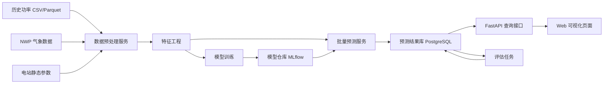
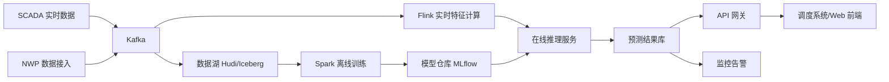
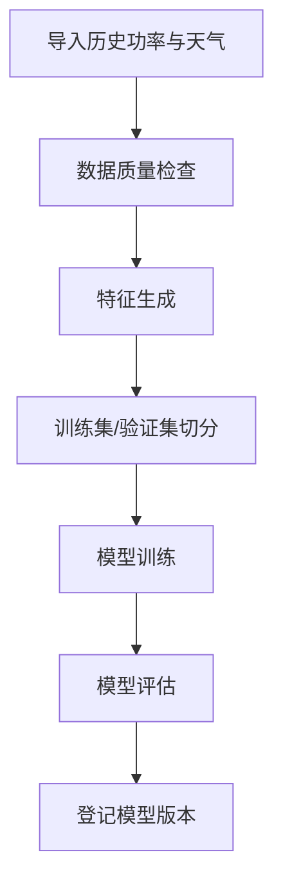
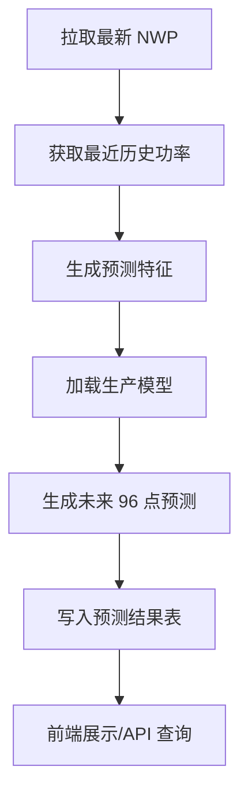
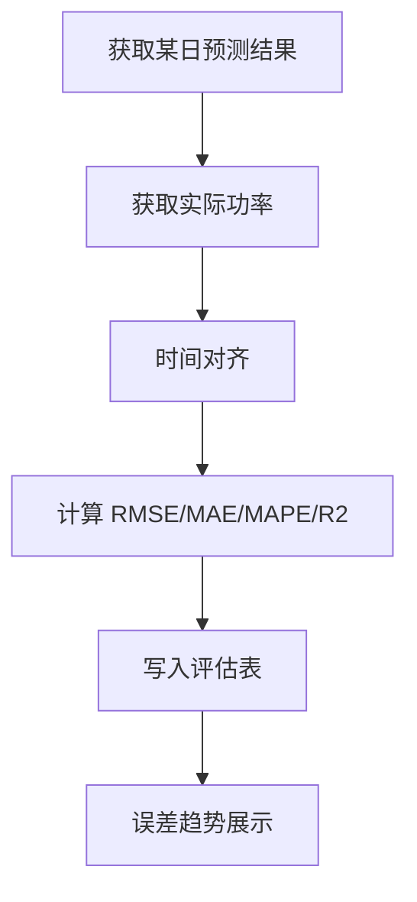

# 光伏电站功率预测系统设计

## 1. 目标与范围

本文档面向本地搭建一套单电站级光伏功率预测系统，优先完成可验证的 MVP 设计，并保留后续向生产级架构演进的路径。

本阶段目标：

- 支持单个光伏电站的短期功率预测，预测范围为未来 24 小时。
- 支持 15 分钟粒度输出预测曲线，共 96 个点。
- 支持点预测结果与基础误差评估。
- 支持后续扩展到超短期预测、概率预测、多电站聚合预测。

本阶段不优先实现：

- 省级区域聚合预测。
- 电力市场优化报价。
- 实时流式超短期滚动预测。
- 复杂分布式光伏反演预测。

## 2. 设计原则

- 先验证业务闭环，再增加大数据复杂度。
- 先做离线训练和准实时预测，再扩展到流式实时预测。
- 先做单电站，再扩展到多电站和区域聚合。
- 先建立统一数据模型和特征口径，再切换模型或计算引擎。
- 本地环境以低成本可运行、可观察、可迭代为第一优先级。

## 3. 业务边界与核心场景

### 3.1 预测对象

- 对象：单个光伏电站并网点总有功功率。
- 单位：kW 或 MW。
- 粒度：15 分钟。
- 时间尺度：
  - 短期预测：未来 24 小时。
  - 后续扩展：未来 72 小时。
  - 后续扩展：超短期 4 小时滚动预测。

### 3.2 核心输入数据

- 历史功率数据：并网点实际有功功率。
- 气象预报数据：GHI、DNI、DHI、云量、环境温度、湿度、风速、风向。
- 站内运行数据：逆变器功率、电压、电流、组件温度、故障状态、限电标记。
- 静态信息：经纬度、海拔、装机容量、组件倾角、方位角、逆变器容量。
- 时间维度：节气、季节、小时、工作日/周末。

### 3.3 核心输出

- 未来 24 小时 96 个点的预测值。
- 每个点的预测时间、发布时间、模型版本。
- 每日评估指标：RMSE、MAE、MAPE、R2。
- 后续扩展：P10/P50/P90 区间预测。

## 4. 功能需求

### 4.1 数据侧

- 支持导入历史 CSV 或 Parquet 数据。
- 支持导入数值天气预报数据。
- 支持数据清洗、缺失补齐、异常值标记。
- 支持统一时间轴对齐。
- 支持训练集、验证集、测试集切分。

### 4.2 模型侧

- 支持基线模型训练。
- 支持树模型训练，如 XGBoost、LightGBM、Random Forest。
- 支持时序模型扩展，如 LSTM。
- 支持模型评估与版本管理。
- 支持离线批量预测。

### 4.3 服务侧

- 支持手动触发预测。
- 支持定时生成日前预测结果。
- 支持查询某日预测曲线。
- 支持查询历史实际值与误差对比。
- 支持查看模型版本与训练时间。

### 4.4 展示侧

- 展示预测曲线和实际曲线。
- 展示天气输入关键特征。
- 展示误差趋势。
- 展示模型版本和最近一次运行状态。

## 5. 非功能需求

- 可维护性：模块解耦，训练、推理、展示分离。
- 可演进性：本地 MVP 方案可平滑升级到 Spark/Flink/Hudi 方案。
- 可追溯性：预测结果、模型版本、输入数据版本可回溯。
- 可观测性：任务日志、接口日志、评估指标可查询。
- 可部署性：支持本地 Docker Compose 启动。

## 6. 总体架构

建议采用“两阶段架构”：

- 阶段 A：本地 MVP 架构，优先跑通全链路。
- 阶段 B：生产演进架构，面向大规模数据与实时化。

### 6.1 本地 MVP 架构

### 6.2 生产演进架构

## 7. 为什么本地阶段不建议一开始就上 Spark/Flink/Hudi

如果当前目标是“尽快搭出一套可验证的单电站光伏预测系统”，直接上 Spark、Flink、Hudi 会显著增加环境复杂度，但不会同步提高首版预测精度。

更合理的路径是：

- 本地 MVP 先用 Python + PostgreSQL + MLflow + FastAPI 打通。
- 当数据量增大、站点增多、预测频率提升后，再升级为 Spark/Flink/Hudi。

这不是降级，而是把复杂度放在正确阶段。

## 8. 逻辑分层设计

### 8.1 数据接入层

职责：接入原始数据并落库。

模块：

- 功率数据导入器
- 气象数据导入器
- 静态参数导入器
- 数据校验器

输出：

- 原始功率表
- 原始天气表
- 电站维表

### 8.2 数据处理层

职责：清洗、补齐、对齐、标准化。

处理规则建议：

- 时间对齐到 15 分钟整点。
- 夜间辐照度为 0 时，功率应接近 0。
- 非法负值功率标记为异常。
- 限电、故障、停机样本单独打标签，不直接混入正常训练集。
- 缺失值按特征类别采用前向填充、插值或丢弃策略。

### 8.3 特征工程层

职责：生成训练和预测统一口径的特征。

建议特征：

- 时间特征：hour、minute_slot、day_of_week、month、is_holiday。
- 天气特征：ghi、dni、dhi、temperature、humidity、cloud_cover、wind_speed。
- 滞后特征：power_lag_1、power_lag_2、power_lag_4、power_lag_96。
- 滚动特征：power_roll_mean_4、power_roll_std_4、ghi_roll_mean_4。
- 天文特征：sun_elevation、sun_azimuth、clear_sky_ghi。
- 站点特征：capacity_mw、tilt_angle、azimuth_angle。

约束：

- 所有特征生成逻辑必须训练与推理一致。
- 标准化器和编码器只能基于训练集拟合。

### 8.4 模型训练层

职责：训练、评估、登记模型。

模型策略建议：

- 第一阶段基线：XGBoost 或 LightGBM。
- 第二阶段增强：加入 LSTM 或 Temporal Fusion Transformer。
- 第三阶段融合：树模型 + 深度学习加权融合。

训练策略：

- 按时间顺序切分训练集、验证集、测试集。
- 使用滚动窗口验证，避免随机切分造成数据泄露。
- 每次训练记录特征集版本、参数、指标、训练样本区间。

### 8.5 推理服务层

职责：加载最新可用模型，结合最新 NWP 和最近历史数据生成预测。

模式：

- 日前批量预测：每天固定时间生成次日 96 点预测。
- 手动重算：用于调试和模型回放。
- 后续扩展：每 15 分钟滚动生成超短期预测。

### 8.6 结果服务层

职责：存储、查询、对比、回溯。

能力：

- 查询某站某日预测曲线。
- 查询实际曲线和误差。
- 按模型版本回放历史预测。
- 对比多个模型同日预测表现。

### 8.7 展示与运维层

职责：提供界面和系统运行可见性。

模块：

- 预测看板
- 误差看板
- 任务运行监控
- 模型版本管理页

## 9. 物理部署建议

### 9.1 本地开发部署

推荐使用 Docker Compose，组件如下：

- `postgres`: 存储原始数据、特征索引、预测结果、评估指标。
- `minio`: 存储原始文件、特征快照、模型文件。
- `mlflow`: 管理实验、参数、模型版本。
- `api`: FastAPI 服务，提供预测查询接口。
- `scheduler`: 定时任务服务，可用 Prefect、Airflow 或简单 Cron。
- `web`: 前端页面，可用 Streamlit、Plotly Dash 或 React。

### 9.2 生产部署演进

- 对象存储：S3 或 HDFS。
- 数据湖：Hudi 或 Iceberg。
- 离线计算：Spark。
- 实时计算：Flink。
- 消息总线：Kafka。
- 服务编排：Kubernetes。

## 10. 核心数据模型

### 10.1 `plant_info`

- `plant_id`
- `plant_name`
- `plant_type`
- `capacity_mw`
- `latitude`
- `longitude`
- `elevation`
- `tilt_angle`
- `azimuth_angle`
- `timezone`

### 10.2 `power_actual`

- `plant_id`
- `ts`
- `active_power_kw`
- `curtailment_flag`
- `fault_flag`
- `data_quality_flag`
- `created_at`

主键建议：`plant_id + ts`

### 10.3 `weather_forecast`

- `plant_id`
- `forecast_run_time`
- `target_time`
- `ghi`
- `dni`
- `dhi`
- `temperature`
- `humidity`
- `cloud_cover`
- `wind_speed`
- `wind_direction`
- `source`

主键建议：`plant_id + forecast_run_time + target_time + source`

### 10.4 `feature_snapshot`

- `plant_id`
- `feature_time`
- `feature_version`
- `feature_payload`
- `dataset_role`

### 10.5 `model_registry_ref`

- `model_name`
- `model_version`
- `framework`
- `feature_version`
- `metrics_json`
- `artifact_uri`
- `train_start_time`
- `train_end_time`
- `status`

### 10.6 `power_forecast`

- `plant_id`
- `forecast_run_time`
- `target_time`
- `model_name`
- `model_version`
- `pred_power_kw`
- `lower_bound_kw`
- `upper_bound_kw`
- `horizon_minutes`
- `created_at`

主键建议：`plant_id + forecast_run_time + target_time + model_version`

### 10.7 `forecast_evaluation`

- `plant_id`
- `forecast_date`
- `model_name`
- `model_version`
- `rmse`
- `mae`
- `mape`
- `r2`
- `sample_count`
- `created_at`

## 11. 任务编排设计

### 11.1 离线训练流程

### 11.2 日前预测流程

### 11.3 评估回写流程

## 12. API 设计建议

### 12.1 预测查询

- `GET /api/v1/plants/{plant_id}/forecasts`
- 参数：`forecast_date`、`model_version`
- 返回：96 点预测曲线

### 12.2 实际值查询

- `GET /api/v1/plants/{plant_id}/actuals`
- 参数：`start_time`、`end_time`

### 12.3 误差查询

- `GET /api/v1/plants/{plant_id}/evaluations`
- 参数：`start_date`、`end_date`

### 12.4 手动触发预测

- `POST /api/v1/jobs/forecast-dayahead`

### 12.5 手动触发训练

- `POST /api/v1/jobs/train`

## 13. 模型设计建议

### 13.1 首版推荐模型

首版建议选用 LightGBM 或 XGBoost，原因如下：

- 对中小规模结构化数据效果稳定。
- 对缺失值和非线性关系适应较好。
- 训练与推理成本低，适合本地先验证。
- 对特征重要性可解释性较好。

### 13.2 不建议首版就用纯 LSTM 的原因

- 对数据量、连续性、调参要求更高。
- 首版容易把大量时间消耗在模型调参与训练稳定性上。
- 在结构化气象特征场景下，树模型通常更适合做第一个高质量基线。

### 13.3 推荐模型演进顺序

1. Baseline：Persistence 基线模型。
2. Tree Model：LightGBM / XGBoost。
3. Hybrid：Tree Model + LSTM。
4. Probabilistic：Quantile Regression。

## 14. 数据质量规则建议

- 夜间辐照度接近 0，但功率明显大于 0，标记异常。
- 白天辐照度高但功率长时间为 0，标记停机或故障嫌疑。
- 功率大于装机容量一定阈值，标记异常。
- 天气数据缺失超过阈值时，中止预测任务并告警。
- 实际功率缺失超过阈值时，不参与训练样本构建。

## 15. 监控与告警建议

- 数据接入成功率。
- 每日预测任务成功率。
- 预测数据生成延迟。
- 最近 7 天 RMSE 趋势。
- 模型漂移告警。
- 气象源缺失告警。

## 16. 本地 MVP 推荐技术栈

### 16.1 后端

- Python 3.11
- FastAPI
- Pydantic
- SQLAlchemy

### 16.2 数据与训练

- Pandas 或 Polars
- Scikit-learn
- XGBoost 或 LightGBM
- MLflow

### 16.3 存储

- PostgreSQL
- MinIO

### 16.4 调度

- Prefect 或 APScheduler

### 16.5 前端

- 首版优先：Streamlit
- 二阶段：React + ECharts

## 17. 为什么我建议首版前端用 Streamlit 而不是 React

如果当前阶段重点是验证预测链路和指标，Streamlit 可以更快形成业务可见结果，减少前后端分离带来的额外开发成本。

等我们确认系统方案和接口稳定后，再切换到 React 管理端更合理。

## 18. 里程碑建议

### 里程碑 1：设计确认

- 确认单电站场景。
- 确认 24h、15min 粒度。
- 确认首版只做日前点预测。
- 确认首版采用本地 MVP 架构。

### 里程碑 2：框架搭建

- 初始化项目目录。
- 搭建 Docker Compose。
- 建立数据库与对象存储。
- 搭建 FastAPI、训练脚本、任务调度骨架。

### 里程碑 3：数据闭环

- 导入公开数据。
- 完成清洗与特征工程。
- 训练首版基线模型。
- 完成预测结果存储与展示。

### 里程碑 4：模型增强

- 增加树模型调参。
- 增加概率预测。
- 增加误差看板。

### 里程碑 5：工程化增强

- 增加模型回滚。
- 增加自动重训。
- 增加在线滚动预测。

## 19. 当前建议的最终方案

如果你的目标是“先在本地做出一套能跑、能看、能评估的光伏电站功率预测系统”，我建议最终确认以下方案：

- 场景：单光伏电站。
- 粒度：15 分钟。
- 范围：未来 24 小时。
- 架构：离线训练 + 日前批量预测 + API 查询 + 可视化。
- 技术栈：Python、PostgreSQL、MinIO、MLflow、FastAPI、Streamlit。
- 模型：LightGBM 或 XGBoost 作为首版主模型。
- 数据：公开光伏功率数据 + 公开天气数据或比赛样本数据。

## 20. 待确认项

在进入框架搭建前，需要你确认以下设计决策：

1. 首版是否只做单电站光伏预测。
2. 首版是否只做日前 24 小时点预测，不做概率预测。
3. 首版前端是否接受用 Streamlit 快速展示。
4. 本地是否接受 Docker Compose 方式部署。
5. 首版是否接受使用公开数据集作为模拟数据源。
