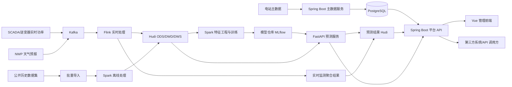
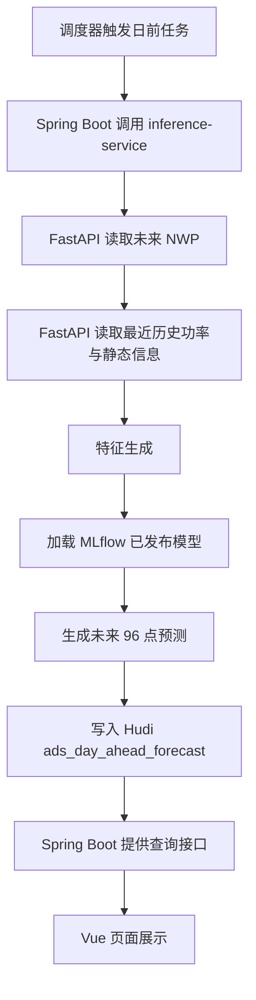
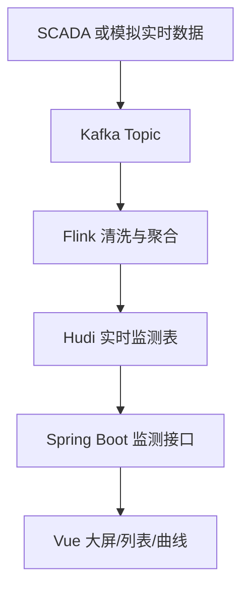

# 光伏电站功率预测与实时监测平台架构设计

## 1. 目标

本文档用于定义一套面向多个光伏电站的基础数据平台与功率预测平台架构，满足以下约束：

- 前端采用 Vue。
- 平台后端采用 Java Spring Boot。
- 算法与数据处理微服务采用 Python FastAPI。
- 数据湖采用 Hudi。
- 计算引擎直接采用 Spark 和 Flink。
- 消息总线采用 Kafka。
- 容器编排采用 Kubernetes。
- 本地阶段接受 Docker 部署。
- 首期数据源可采用公开数据集模拟。
- 首期预测能力只实现日前 24 小时点预测。
- 平台同时具备实时功率监测能力。

设计目标不是只做一个轻量 Demo，而是在最简可运行功能之上，保留完整生产级技术骨架和可扩展边界。

## 2. 建设范围

### 2.1 首期范围

- 支持多个光伏电站基础档案管理。
- 支持接入历史功率、实时功率、天气预报、设备状态数据。
- 支持日前 24 小时功率点预测，粒度 15 分钟。
- 支持实时功率监测与可视化展示。
- 支持预测结果查询、实际值对比、误差评估。
- 支持模型服务通过 API 方式被平台和其他组件调用。

### 2.2 后续扩展范围

- 超短期滚动预测。
- 概率预测与 P10/P50/P90 区间输出。
- 区域级聚合预测。
- 告警联动与运维工单。
- 电力市场申报与调度对接。

## 3. 设计原则

- 平台层与算法层解耦，平台不直接承载模型训练细节。
- 流批一体但首期功能最小化，先保留骨架，再逐步启用能力。
- 所有核心数据先入湖，再按需服务化。
- 实时监测与预测结果采用统一主数据和时间轴规范。
- 本地部署结构尽量贴近未来生产结构，减少后续重构。

## 4. 总体架构

平台采用“五层架构 + 两类后端服务”模式：

- 采集接入层
- 存储与数据湖层
- 计算与特征层
- 服务与应用层
- 展示与运维层

后端服务分为：

- Java 平台微服务
- Python 算法微服务



## 5. 业务能力拆分

### 5.1 平台侧能力

- 电站主数据管理。
- 数据源配置管理。
- 实时功率监测。
- 日前预测结果查询。
- 历史实际与预测对比分析。
- 任务调度与运行状态查看。
- 统一权限、审计、操作日志。

### 5.2 算法侧能力

- 训练样本构建。
- 特征工程。
- 模型训练与评估。
- 模型版本管理。
- 日前 24 小时推理。
- 预测 API 对外服务。

## 6. 微服务划分

### 6.1 Java Spring Boot 微服务

建议首期至少拆成以下 5 个服务，物理可先合并部署，逻辑上先分层：

#### 1. `gateway-service`

- 统一入口。
- 鉴权、限流、路由转发。
- 可选 Spring Cloud Gateway。

#### 2. `plant-service`

- 电站档案管理。
- 装机容量、经纬度、设备信息管理。
- 数据源绑定关系管理。

#### 3. `monitor-service`

- 实时功率查询。
- 实时状态聚合。
- 实时告警视图。

#### 4. `forecast-service`

- 预测任务发起。
- 预测结果查询。
- 预测与实际对比。
- 调用 Python FastAPI 算法服务。

#### 5. `system-service`

- 用户、角色、权限。
- 操作日志。
- 字典配置。
- 参数配置。

### 6.2 Python FastAPI 微服务

建议拆成以下 3 个服务：

#### 1. `feature-service`

- 从 Hudi 读取数据。
- 生成训练和预测所需特征。
- 统一离线和在线特征口径。

#### 2. `model-service`

- 训练模型。
- 评估模型。
- 向 MLflow 注册模型。

#### 3. `inference-service`

- 加载指定模型版本。
- 执行日前 24 小时批量预测。
- 对外暴露预测接口。

首期如果要控制复杂度，这 3 个 Python 服务可以先合并成一个 FastAPI 应用，再在代码结构上拆模块。

## 7. 数据分层设计

Hudi 数据湖建议采用经典分层：

- ODS：原始接入层。
- DWD：明细标准层。
- DWS：主题汇总层。
- ADS：应用服务层。

### 7.1 ODS 层

存放原始数据：

- 原始实时功率。
- 原始历史功率。
- 原始天气预报。
- 原始设备状态。

特点：

- 保留原始字段。
- 尽量少做业务加工。
- 支持追溯与重放。

### 7.2 DWD 层

标准化清洗后明细数据：

- 时间对齐到 15 分钟。
- 异常值标记。
- 缺失值补齐策略输出。
- 电站维度标准化。

### 7.3 DWS 层

主题宽表：

- 电站功率主题宽表。
- 天气特征主题宽表。
- 训练样本主题宽表。
- 实时监测主题宽表。

### 7.4 ADS 层

面向查询和接口输出的数据：

- 日前预测结果表。
- 实时功率监测表。
- 日评估指标表。
- 前端看板聚合表。

## 8. Hudi 表设计策略

### 8.1 适合 Hudi 的原因

- 预测结果会周期性更新，适合 Upsert。
- 实时功率会持续追加并可能存在迟到数据。
- 需要按时间和电站维度回溯历史状态。
- 需要在批处理和流处理场景中共享数据。

### 8.2 首期关键 Hudi 表

#### `ods_power_realtime`

- `plant_id`
- `device_id`
- `ts`
- `active_power_kw`
- `reactive_power_kvar`
- `voltage`
- `current`
- `status_code`
- `event_time`

#### `ods_weather_forecast`

- `plant_id`
- `forecast_run_time`
- `target_time`
- `ghi`
- `dni`
- `dhi`
- `temperature`
- `humidity`
- `cloud_cover`
- `wind_speed`
- `source`

#### `dwd_power_15m`

- `plant_id`
- `ts`
- `active_power_kw`
- `curtailment_flag`
- `fault_flag`
- `quality_flag`

#### `dws_pv_training_features`

- `plant_id`
- `feature_time`
- `feature_version`
- `feature_json`
- `label_power_kw`

#### `ads_day_ahead_forecast`

- `plant_id`
- `forecast_date`
- `forecast_run_time`
- `target_time`
- `model_name`
- `model_version`
- `pred_power_kw`
- `created_at`

#### `ads_realtime_power_dashboard`

- `plant_id`
- `ts`
- `active_power_kw`
- `capacity_mw`
- `load_factor`
- `status_summary`

## 9. 计算架构设计

### 9.1 Flink 实时链路

Flink 负责实时功率监测链路，不在首期承担复杂在线预测，只保留未来扩展接口。

首期职责：

- 消费 Kafka 中的 SCADA 实时功率消息。
- 做基础清洗和时间窗口聚合。
- 将实时明细和监测聚合结果写入 Hudi。
- 生成前端需要的实时监测主题数据。

后续职责：

- 计算超短期滚动特征。
- 触发在线推理。
- 实时误差监控和模型漂移告警。

### 9.2 Spark 离线链路

Spark 负责训练样本构建和离线计算。

首期职责：

- 从 Hudi 读取历史功率和天气数据。
- 构建训练特征。
- 输出训练数据集。
- 调用 Python 训练任务或与其协同。
- 回写评估结果和预测结果。

后续职责：

- 多模型并行训练。
- 大规模多电站特征计算。
- 区域聚合预测样本生成。

## 10. 预测架构设计

### 10.1 首期预测模式

首期仅做日前 24 小时点预测。

输入：

- 历史 15 分钟功率数据。
- 未来 24 小时天气预报。
- 电站静态信息。

输出：

- 每个电站未来 96 个点的预测值。

### 10.2 预测执行流程



### 10.3 模型路线

首期建议：

- 主模型采用 LightGBM 或 XGBoost。
- 每个电站可独立训练，也可先采用统一模型加电站特征。
- 采用滚动时间窗口验证。

后续演进：

- LSTM/TFT。
- 多模型融合。
- 分位数回归。

## 11. 实时监测架构设计

### 11.1 监测目标

- 实时展示多电站当前功率。
- 实时展示装机容量利用率。
- 实时展示设备状态摘要。
- 实时展示近 1 小时、近 24 小时趋势。

### 11.2 实时处理流程



### 11.3 首期最小实现

即使还没有真实 SCADA，也可以通过公开数据集回放为伪实时消息流，验证整条实时链路。

## 12. 服务调用关系

### 12.1 同步调用

- Vue 调用 Spring Boot 平台 API。
- Spring Boot 调用 FastAPI 预测接口。
- Spring Boot 查询 PostgreSQL 元数据。

### 12.2 异步调用

- 实时数据通过 Kafka 进入 Flink。
- 批量任务由调度器触发 Spark 作业。
- 预测任务完成后回写 Hudi，再由平台侧读取。

## 13. 存储设计

### 13.1 Hudi

用于存放：

- 原始明细数据。
- 标准化明细数据。
- 训练样本。
- 预测结果。
- 实时监测聚合结果。

### 13.2 PostgreSQL

用于存放：

- 用户与权限。
- 电站主数据。
- 服务配置。
- 任务执行记录。
- 模型发布索引。

### 13.3 MinIO

用于存放：

- 原始文件。
- 训练数据导出文件。
- 模型文件和产物。
- 报表导出文件。

### 13.4 Redis

用于存放：

- 热点监测数据缓存。
- 查询结果缓存。
- 会话和限流信息。

## 14. 调度与编排

建议采用 Airflow 或 DolphinScheduler。

首期必备任务：

- 历史数据导入任务。
- 天气数据导入任务。
- 日前预测任务。
- 评估回算任务。
- 模型训练任务。

## 15. 前端架构设计

前端采用 Vue 3，建议使用：

- Vue 3
- TypeScript
- Vite
- Pinia
- Vue Router
- ECharts
- Element Plus 或 Ant Design Vue

### 15.1 页面建议

- 登录页。
- 平台首页总览。
- 电站监测列表页。
- 单电站实时监测页。
- 日前预测曲线页。
- 预测误差分析页。
- 电站管理页。
- 任务运行页。

### 15.2 首页核心指标卡片

- 电站总数。
- 当前总实时功率。
- 今日预测任务成功数。
- 最近 7 天平均 RMSE。
- 异常电站数量。

## 16. Kubernetes 部署架构

### 16.1 生产部署单元

- `frontend-web`
- `gateway-service`
- `plant-service`
- `monitor-service`
- `forecast-service`
- `system-service`
- `feature-service`
- `model-service`
- `inference-service`
- `kafka`
- `flink-jobmanager`
- `flink-taskmanager`
- `spark`
- `postgresql`
- `redis`
- `minio`
- `mlflow`

### 16.2 本地部署建议

本地首期采用 Docker Compose 或 k3d/kind，建议策略如下：

- Docker Compose 承载基础组件和服务。
- Flink、Spark 先采用单机简化模式。
- Kafka 单节点部署。
- Hudi 使用本地对象存储或挂载卷。

这样既不牺牲总体技术骨架，也能把启动复杂度控制在可接受范围。

## 17. 安全与治理设计

- API 统一经网关暴露。
- 平台侧统一 JWT 或 OAuth2 鉴权。
- 服务间调用采用内部网络和服务鉴权。
- 数据分层控制访问权限。
- 关键操作保留审计日志。

## 18. 可观测性设计

建议配套：

- Prometheus
- Grafana
- Loki 或 ELK

监控指标包括：

- Kafka Topic 消费延迟。
- Flink 作业状态。
- Spark 作业成功率。
- 预测任务成功率。
- FastAPI 接口耗时。
- Spring Boot 接口耗时。
- Hudi 写入延迟。
- 最近 7 天 RMSE 趋势。

## 19. 首期最简可运行版本建议

为了保证“框架完善但功能最简”，建议首期只实现下面这条业务闭环：

1. 导入多个电站的公开历史功率和天气数据。
2. Kafka 回放一部分历史功率作为伪实时流。
3. Flink 处理伪实时流并生成实时监测结果。
4. Spark 构建训练特征。
5. FastAPI 训练一个树模型并注册到 MLflow。
6. FastAPI 执行日前 24 小时预测并写入 Hudi。
7. Spring Boot 提供统一查询 API。
8. Vue 展示实时功率和预测曲线。

这条闭环已经具备完整平台形态，只是把高级功能压缩到最小实现。

## 20. 推荐项目结构

```text
power_predict/
  docs/
  deploy/
    docker-compose/
    kubernetes/
  frontend/
    web-portal/
  backend/
    java/
      gateway-service/
      plant-service/
      monitor-service/
      forecast-service/
      system-service/
    python/
      app/
        feature-service/
        model-service/
        inference-service/
      jobs/
        spark/
        flink/
  data/
    sample/
  scripts/
  sql/
```

## 21. 关键设计决策

### 21.1 为什么平台后端与算法服务分开

因为两者职责完全不同：

- Spring Boot 负责业务平台、权限、流程和统一 API。
- FastAPI 负责训练、推理和模型能力开放。

这样可以避免 Java 服务承载算法复杂度，也避免 Python 服务侵入平台治理逻辑。

### 21.2 为什么保留 Spark 和 Flink，即使首期功能很少

因为你的目标不是普通业务系统，而是面向新能源预测平台的工业级底座。实时链路和离线链路在首期就定型，后面只是在这个骨架上逐步打开能力。

### 21.3 为什么 Hudi 比直接数据库更合适

因为功率、天气、预测结果都是典型时序数据，并且存在追加、修正、回溯、增量读取需求，Hudi 更符合数据湖与流批一体场景。

## 22. 风险与控制点

- 风险：本地一次性启动全部组件复杂度高。
  - 控制：首期允许服务合并部署，逻辑分层先行。
- 风险：公开数据集与真实 SCADA 字段差异大。
  - 控制：先定义统一接入协议和标准字段。
- 风险：Spark/Flink/Hudi 本地调试成本较高。
  - 控制：先保证单节点可跑通，再扩容部署。
- 风险：多服务协同导致联调周期长。
  - 控制：优先定义 API 契约和表结构。

## 23. 当前建议落地方案

基于你的确认，当前推荐的正式落地方案如下：

- 前端：Vue 3 + TypeScript + Vite + ECharts。
- 平台后端：Spring Boot 微服务。
- 算法服务：Python FastAPI。
- 流式处理：Kafka + Flink。
- 离线训练与特征：Spark。
- 数据湖：Hudi。
- 元数据与业务库：PostgreSQL。
- 缓存：Redis。
- 模型仓库：MLflow。
- 对象存储：MinIO。
- 部署：本地 Docker Compose，后续 Kubernetes。
- 首期能力：多电站实时功率监测 + 日前 24 小时点预测。

## 24. 下一步输出建议

在这份架构设计确认后，建议下一步按顺序产出以下 4 份落地文档：

1. 系统模块清单与服务边界说明。
2. 数据库与 Hudi 表结构设计。
3. 服务 API 契约设计。
4. 项目脚手架与部署结构设计。
